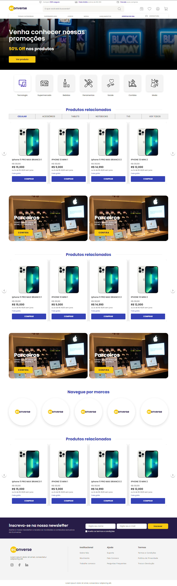

## Teste Front-end da 

## 💻 Deploy



<p aling="center">
<a href="https://teste-front-end-orcin.vercel.app/">Clique aqui para ver o projeto</a>
</p>

## 🔧 Instalação

Instalação com npm

```bash
  git clone "https://github.com/rogergit33/teste-front-end"
  cd test
  npm install
```

## 🔌 Como Rodar

```bash
  npm run dev
  endereço: http://localhost:5173
```

## 📌 Descrição do projeto

<p>Este projeto consiste no desenvolvimento de uma página web utilizando React e TypeScript, seguindo rigorosamente o layout proposto no Figma.</p>

<p>O objetivo principal é construir uma vitrine de produtos dinâmica, consumindo dados a partir de um arquivo JSON externo e garantindo fidelidade total ao design fornecido.</p>

## 🚀 Requisitos do Projeto

## 🎨 Layout

<ul>
<li>Implementação fiel ao layout disponibilizado no Figma.</li>
<li>Respeito pixel a pixel aos seguintes elementos:</li>
<li>Tamanhos de fonte</li>
<li>Cores</li>
<li>Espaçamentos</li>
<li>Botões</li>
<li>Grid e alinhamentos</li>
<li>O layout deve ser copiado para sua conta no Figma para habilitar o modo de edição e inspeção.</li>
</ul>

## 🛍️ Vitrine de Produtos

<ul>
<li>Renderização dinâmica dos produtos consumindo dados via JSON.</li>
<li>Exibição das principais informações do produto conforme especificado no layout</li>
<li>Estrutura organizada e componentizada utilizando boas práticas do React.</li>
</ul>

## 🔎 Interação com Produto

<ul>
<li>
Ao clicar no botão comprar de um produto, deve ser exibido um modal.
</li>
<li>O modal deve apresentar:</li>
<li>Principais informações do produto</li>
<li>A interação deve seguir exatamente o comportamento descrito no layout.</li>
</ul>

## 📊 Tecnologias e libs utilizadas

<ul>
<li>React</li>
<li>TypeScript</li>
<li>Saas</li>
</ul>
